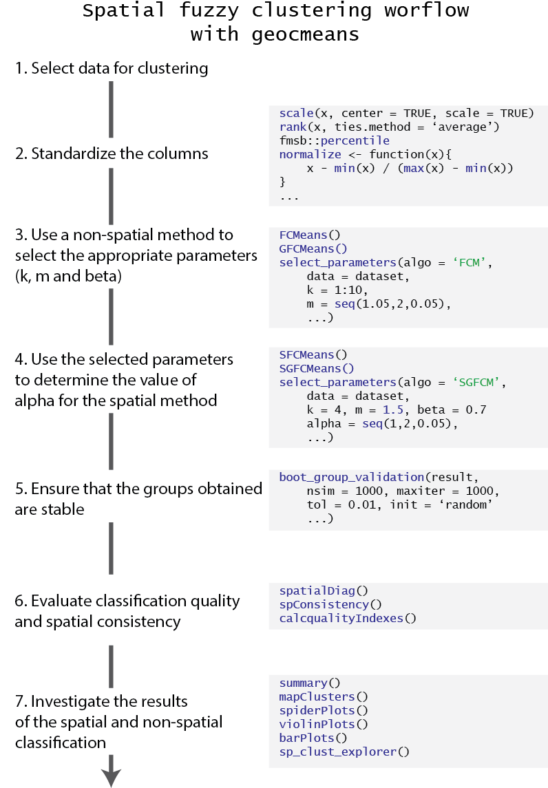

# Summary

Unsupervised classification methods like *k-means* or the *Hierarchical Cluster Analysis* (HCA) are widely used in geography even though they are not well suited for spatial data [@romary2015unsupervised;] because they do not consider space. Yet, recent development has been proposed to include the geographical dimension into clustering. As an example, `ClustGeo` [@chavent2018clustgeo] is a spatial extension of the HAC, available in the R package with the same name. We present here the R package `geocmeans`, proposing several spatial extensions of the *Fuzzy C-Means* (FCM) algorithm to complete this growing toolbox with a fuzzy approach. The package provides also several helper functions to assess and compare quality of classifications, select appropriate hyperparameters, and interpret the final groups.

{width="20%"}

# Statement of need

Traditional clustering algorithms do not account for the geographical dimension of data causing two main concerns:

-   First, an important part of the information related to observations' locations and geographical organization is disregarded. Often, in social, environmental and economical sciences, the geographical dimension is highly structuring and displays positive spatial autocorrelation.
-   Second, in many applications (like the development of regional policy), it is desirable that close observations are more likely to belong to the same group. In this regard, it is common to observe with traditional unsupervised classification algorithms "holes": observations attributed to a certain group and surrounded by observations attributed to another. Often, the difference in the attributes between those observations does not justify such spatial inconsistency.

A first approach for spatial clustering explored from the 1990s was to impose to the classification a spatial constraint based on contiguity (also called aggregation based approach). The most probably known methods are the `AZP` [@openshaw1977geographical], `SKATER`[@assunccao2006efficient] and `AMOEBA` [@aldstadt2006using]. However, this approach can only yield spatially continuous groups and can be too strict to obtain meaningful clusters. That is why a new approach has been proposed: including the spatial dimension in the clustering process. In this approach, space should not act as a constraint in the classification, but as supplementary data.

The recent method `ClustGeo` [@chavent2018clustgeo] has received some attention from geographers. However, it yields a hard clustering and may hide situations were observations are located at the border of two groups. There is thus a need for available unsupervised spatial fuzzy clustering methods.

Such methods have been discussed and applied in the brain imagery segmentation field [@cai2007fast; @zhao2013kernel] leading to the development of the Spatial Fuzzy C-means (SFCM) algorithm. The package `geocmeans` is proposed to make this tool available to researchers and professionals working with spatial datasets. A first application to construct a socio-residential and environmental taxonomy in Lyon has outlined the potential of the method [@gelb2021apport].

# Core functionality

The `geocmeans` package has been built to be self-sufficient and minimize the coding need from users. Thus, several helper functions are available along the main clustering algorithms to asses classification quality, select hyper parameters, test cluster robustness, and interpret results. It is also possible to use the results from external clustering algorithm to build `FCMres` objects and work with most of the functions of `geocmeans`.

{width="40%"}

## Main algorithm

`geocmeans` provides four fuzzy unsupervised classification algorithms:

-   `CMeans`, the original c-means algorithm, requiring two hyper parameters, *m* (fuzzyness degree) and *k* (number of groups).

-   `GFCMeans`, the so-called generalized c-means algorithm. It is known to accelerate convergence and yield less fuzzy result by adjusting the membership matrix at each iteration. It requires an extra $\beta$ parameter controlling the strength of the modification. The modification only affects the formula updating the membership matrix.

$$u_{ik} = \frac{(||x_{k} - v{_i}||^{2} - \beta_k) ^{(-1/(m-1))}}{\sum_{j=1}^c(||x_{k} - v{_j}||^2 - \beta_k)^{(-1/(m-1))}}$$

with:\
$\beta_k = min(||x_{k} - v||^2)$\
$0 \leq \beta \leq 1$\
$u_{ik}$ the probability for observation *k* to belong to cluster *i*\
$x_k$ the observation *k* in the dataset *x*\
$v_i$ the cluster *i*\
*m* the fuzzyness parameter

-   `SFCMeans`, the *SFCM* algorithm, requiring two more parameters *W* and $\alpha$. *W* is a spatial weight matrix used to calculate a spatially lagged version of the dataset *x*. $\alpha$ is used to control the weight of the spatially lagged dataset. If $\alpha = 0$ then *SFCM* becomes a simple FCM. If $\alpha = 1$ the same weight is given to the original and lagged dataset. If $\alpha = 2$ then the spatially lagged dataset has a weight doubled in comparison with the original dataset, and so on... The integration of the spatially lagged dataset modifies the formula updating the membership matrix and the formula updating the centers of clusters.

$$u_{ik} = \frac{(||x_{k} - v{_i}||^2 + \alpha||\bar{x_{k}} - v{_i}||^2)^{(-1/(m-1))}}{\sum_{j=1}^c(||x_{k} - v{_j}||^2 + \alpha||\bar{x_{k}} - v{_j}||^2)^{(-1/(m-1))}}$$

$$v_{i} = \frac{\sum_{k=1}^N u_{ik}^m(x_{k} + \alpha\bar{x_{k}})}{(1 + \alpha)\sum_{k=1}^N u_{ik}^m}$$

with:

$0 \leq \alpha \leq \infty$\
$v_i$ the cluster *i*\
$\bar{x}$ the spatially lagged version of *x*\

As the formula suggests, the SFCM can be seen as a spatially smoothed version of the FCM and $\alpha$ controls the degree of spatial smoothness. This smoothing can be interpreted as an attempt to reduce spatial overfitting of the FCM.

-   `SGFCMeans`, the *SGFCM* algorithm, combining *SFCM* and *SGFCM* and thus requiring the definition of three extra parameters *W*, $\alpha$ and $\beta$. Only the formula to calculate the membership matrix is different from the SFCM.

$$u_{ik} = \frac{(||x_{k} - v{_i}||^2 -\beta_k + \alpha||\bar{x_{k}} - v{_i}||^2)^{(-1/(m-1))}}{\sum_{j=1}^c(||x_{k} - v{_j}||^2 -\beta_k + \alpha||\bar{x_{k}} - v{_j}||^2)^{(-1/(m-1))}}$$

## Robust versions

*FCM*, *GFCM*, *SFCM* and *SGFCM* can be modified to use a "robust" version of the FCM [@tsai2011fuzzy]

The "robust" versions of the algorithms normalize the distances between the data points and the centres of the clusters. This modification improves the performance of the algorithms for clusters with non-hyperspherical shapes and uneven densities.

For the *FCM* algorithm, the new formula to calculate the membership matrix is the following:

$$u_{i k}=\left[\sum_{j=1}^c\left(\frac{\left\|x_i-v_k\right\|_A^2 / \sigma_k}{\left\|x_i-v_j\right\|_A^2 / \sigma_j}\right)^{\frac{1}{m-1}}\right]^{-1}$$

With:

$$\sigma_j=\left(\frac{\sum_{i=1}^n u_{i j}^m\left\|x_i-v_j\right\|_A^2}{\sum_{i=1}^n u_{i j}^m}\right)^{\frac{l}{2}}$$

For the *SFCM*, the same normalization is applied on the distances calculated from the lagged dataset.

$$u_{ik} = \frac{(||x_{k} - v{_i}||^2 /\sigma_k + \alpha(||\bar{x_{k}} - v{_i}||^2/w\sigma_k))^{(-1/(m-1))}}{\sum_{j=1}^c(||x_{k} - v{_j}||^2 / \sigma_k + \alpha(||\bar{x_{k}} - v{_j}||^2/ w\sigma_k))^{(-1/(m-1))}}$$

With:

$$w\sigma_j=\left(\frac{\sum_{i=1}^n u_{i j}^m\left\|\bar{x_i}-v_j\right\|_A^2}{\sum_{i=1}^n u_{i j}^m}\right)^{\frac{l}{2}}$$

## Noise cluster

For each algorithm, it is possible to add a noise cluster. This extra cluster does not have a centre and has the same distance ($delta$) to each data point [@dave1991characterization]. It is used to catch observations that are too far from the clusters and could be identified as outliers. $delta$ is also a hyperparameter to be selected by the user.

## Selecting parameters

As stated above, up to five hyper parameters have to be selected by the user (six if a noise cluster is added). Finding the best combination is facilitated by the function `selectParameters` calculating the classifications for all the possible combinations of parameters in specified ranges and returning several metrics of classification quality. The documentation also provides an example of how to select the hyperparameters with a multi-objective genetic algorithm.

## Interpreting the results

To interpret the results, several functions are provided:

-   `summarizeClusters`: returning summary statistics for each cluster for in-depth analysis.
-   `spiderPlots`: plotting a spider chart to quickly differentiate the clusters.
-   `violinPlots`: plotting one violin plot split by cluster for each variable in the dataset.
-   `barPlots`: plotting a bar plot to compare means or medians of each cluster.
-   `mapClusters`: mapping the membership matrix and the most likely cluster for the observations.
-   `calcqualityIndexes`: returning several quality indexes for a classification.
-   `spatialDiag`: performing a complete spatial diagnostic to determine if the inclusion of space in the classification is justified.

The package includes a ShinyApp (`sp_clust_explorer`) which can be used to investigate the results interactively (mapping the clusters, bivariate charts, uncertain observations, etc.).

Also, several methods using the R classical S3 object system are available :

-   `summary`: same as `summarizeClusters`.
-   `plot`: wrapper around `spiderPlots`, `violinPlots`, and `barPlots`.
-   `print`: a generic function to display the main attributes of a solution.
-   `predict`: a function to predict the membership of new data points.

## Cluster stability

Considering the random initial state of each algorithm, its is important to asses the robustness of the solution. The function `boot_group_validation` uses a boostrap approach to evaluate if the clusters of a solution are stable or tend to dissolve. During a selected number of iterations (at least 1000), a sample of size *n* (with replacement) is drawn from the original dataset. For each sample, the same classification algorithm is applied and the results are compared with the reference results. For each original group, the most similar group is identified by calculating the Jaccard similarity index between the columns of the two membership matrices. This index is comprised between 0 (exact difference) and 1 (perfect similarity) and a value is calculated for each group at each iteration. One can investigate the values obtained to determine if the groups are stable. Values under 0.5 are a concern and indicate that the group is dissolving. Values between 0.6 and 0.75 indicate a pattern in the data, but a significant uncertainty. Values above 0.8 indicate strong groups. The values of the centres obtained at each iteration are also returned, and can be used to ensure that they approximately follow a normal distribution or are at least unimodal.

## Raster data

Considering the important use of unsupervised classification methods on aerial or satellite imagery, `geocmeans` can also handle `spaRast` objects from the package `terra` and provides functions to build spatial smoothing windows for *SFCM* and *SFGCM*.

# Example

The data used for the socio-residential and environmental taxonomy in Lyon are included in the package. The following example uses this data to demonstrate the basic functionality of the package. More details are given in the vignettes of the package.

``` r
library(geocmeans)
library(spdep)

data(LyonIris)

#selecting the columns for the analysis
AnalysisFields <- c("Lden","NO2","PM25","VegHautPrt","Pct0_14",
                   "Pct_65","Pct_Img","TxChom1564","Pct_brevet","NivVieMed")
                   
#creating a spatial weights matrix
Neighbours <- poly2nb(LyonIris,queen = TRUE)
WMat <- nb2listw(Neighbours,style="W",zero.policy = TRUE)

#rescaling the columns
Data <- st_drop_geometry(LyonIris[AnalysisFields])
for (Col in names(Data)){
  Data[[Col]] <- scale(Data[[Col]])
}

#considering k = 4 and m = 1.5, find an optimal value for alpha
DFindices_SFCM <- selectParameters(algo = "SFCM", data = Data,
            k = 4, m = 1.5, alpha = seq(0,2,0.05),
            nblistw = WMat, standardize = FALSE,
            tol = 0.0001, verbose = FALSE, seed = 456)

#keeping alpha = 0.7
SFCM_results <- SFCMeans(Data, WMat, k = 4, m = 1.5, alpha = 0.7,
                 tol = 0.0001, standardize = FALSE,
                 verbose = FALSE, seed = 456)

#calculating some quality indexes
calcqualityIndexes(Data, SFCM_results$Belongings, m = 1.5)

#mapping the results
mapClusters(LyonIris, SFCM_results$Belongings)

#ploting a radar chart
spiderPlots(st_drop_geometry(LyonIris[AnalysisFields]),
            belongmatrix = SFCM_results$Belongings)
```

# Acknowledgements

We are grateful to Professor Philippe Apparicio for his comments and suggestions on the package, its documentation and this article.

The project was partially funded by the research chair of Canada on environmental equity and the city (950-230813).

# References
