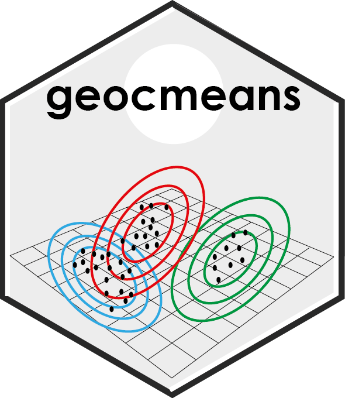

<!-- README.md is generated from README.Rmd. Please edit that file -->

# geocmeans 

## An R package to perform Spatial Fuzzy C-means.

<!-- badges: start -->

<!-- badges: end -->

The website of the package is available
[here](https://jeremygelb.github.io/geocmeans/)

## Breaking news

Here we are! We are moving from `maptools`, `sp`, `rgeos`, `raster` and
`rgdal` to `sf`, `terra` and `tmap`. All the functions and the
documentation were modified accordingly. If you spot an error or a bug,
please open an issue on github.

## Installation

The stable version of `geocmeans` is available on CRAN. You can install
it with the command below.

    install.packages("geocmeans")

You can install a development version of the `geocmeans` package using
the command below.

    remotes::install_github(repo = "JeremyGelb/geocmeans", build_vignettes = TRUE, force = TRUE)

## Authors

Jeremy Gelb, Laboratoire d’Équité Environnemental INRS (CANADA), Email:
<jeremy.gelb@ucs.inrs.ca>

## Contributors

Philippe Apparicio, Laboratoire d’Équité Environnemental INRS (CANADA),
Email: <philippe.apparicio@ucs.inrs.ca>

## About the package

Provides functions to apply Spatial Fuzzy c-means Algorithm, visualize
and interpret results. This method is well suited when the user wants to
analyze data with a fuzzy clustering algorithm and to account for the
spatial dimension of the dataset. In addition, indexes for measuring the
spatial consistency and classification quality are proposed. The
algorithms were developed first for brain imagery as described in the
articles of [Cai and
al. 2007](https://doi.org/10.1016/j.patcog.2006.07.011) and [Zaho and
al. 2013](https://doi.org/10.1016/j.dsp.2012.09.016). [Gelb and
Apparicio](https://doi.org/10.4000/cybergeo.36414) proposed to apply the
method to perform a socio-residential and environmental taxonomy in Lyon
(France). The methods can be applied to dataframes or to rasters.

#### Fuzzy classification algorithms

Four Fuzzy classification algorithms are proposed :

- FCM: Fuzzy C-Means, with the function `CMeans`
- GFCM: Generalized Fuzzy C-Means, with the function `GFCMeans`
- SFCM: Spatial Fuzzy C-Means, with the function `SFCMeans`
- SGFCM: Spatial Generalized Fuzzy C-Means, with the function
  `SGFCMeans`

Each function return a membership matrix, the data used for the
classification (scaled if required) and the centers of the clusters.

For each algorithm, it is possible to calculate a “robust version” and
to add a noise group (used to catch outliers). See the parameters
`robust` and `noise_cluser` in the documentation for more details.

#### Parameter selections

The algorithms available require different parameters to be fixed by the
user. The function `selectParameters` is a useful tool to compare the
results of different combinations of parameters. A multicore version,
`selectParameters.mc`, using a plan from the package `future` is also
available to speed up the calculus.

#### Classification quality

Many indices of classification quality can be calculated with the
function `calcqualityIndexes`:

- *Silhouette.index*: the silhouette index (`fclust::SIL.F`)
- *Partition.entropy*: the partition entropy index (`fclust::PE`)
- *Partition.coeff*: the partition entropy coefficient (`fclust::PC`)
- *Modified.partition.coeff*: the modified partition entropy coefficient
  (`fclust::MPC`)
- *XieBeni.index*: the Xie and Beni index (`fclust::XB`)
- *FukuyamaSugeno.index*: the Fukuyama and Sugeno index
  (`geocmeans::calcFukuyamaSugeno`)
- *DavidBoudlin.index*: the David-Bouldin index
  (`geocmeans::calcDavidBouldin`)
- *CalinskiHarabasz.index*: the Calinski-Harabasz index
  (`geocmeans::calcCalinskiHarabasz`)
- *GD43.index* and *GD53.index*: two version of the generalized Dunn
  index (`geocmeans::calcGD43` and `calcGD53`)
- *Negentropy.index*: the Negentropy Increment index
  (`geocmeans::calcNegentropyI`)
- *Explained.inertia*: the percentage of total inertia explained by the
  solution

#### Classification consistency

To assess the stability of the obtained clusters, a function for
bootstrap validation is proposed: `boot_group_validation`. The results
can be used to verify if the obtained clusters are stable and how much
their centres vary.

#### Reproductibility

Clustering methods like CMeans depend on the initial centers selected.
In `geocmeans`, they are selected randomly, and two runs of the
functions can yield different results. To facilitate the
reproductibility of the results, the main functions of the package
(`CMeans`, `GFCMeans`, `SFCMeans`, `SGFCMeans`, `selectParameters`,
`selectParameters.mc`) have a `seed` parameter. It can be set by the
user to ensure that the results of the functions are exactly the same.

#### Interpretation

Several functions are also available to facilitate the interpretation of
the classification:

- summary statistics for each cluster: `summarizeClusters` (also
  accessible with the generic function `summary`)
- spider charts: `spiderPlots`
- violin plots: `violinPlots`
- maps of the membership matrix: `mapClusters` (support polygon, points
  and polylines)

There is also a shiny app that can be used to go deeper in the result
interpretation. It requires the packages `shiny`, `leaflet`, `bslib`,
`plotly`, `shinyWidgets`, `car`.

#### Spatial diagnostic

Several spatial indices can be calculated to have a better spatial
understanding of the obtained clusters, like the global or local Moran I
calculated on the membership values, or the join-count-test on the most
likely group for each observation. ELSA and Fuzzy ELSA statistics can
also be calculated to identify areas with high or low multidimensional
spatial autocorrelation in the membership values. See functions
`spConsistency`, `calcELSA`, `calcFuzzyELSA` and `spatialDiag`.

We proposed an index to quantify the spatial inconsistency of a
classification ([Gelb and
Apparicio](https://doi.org/10.4000/cybergeo.36414)). If in a
classification close observations tend to belong to the same group, then
the value of the index is close to 0. If the index is close to 1, then
the belonging to groups is randomly distributed in space. A value higher
than one can happen in the case of negative spatial autocorrelation. The
index is described in the vignette `adjustinconsistency`. The function
`spatialDiag` does a complete spatial diagnostic of the membership
matrix resulting from a classification.

## Examples

Detailed examples are given in the vignette `introduction`

    vignette("introduction","geocmeans")

## Testing

If you would like to install and run the unit tests interactively,
include `INSTALL_opts = "--install-tests"` in the installation code.

    remotes::install_github(repo = "JeremyGelb/geocmeans", build_vignettes = TRUE, force = TRUE, INSTALL_opts = "--install-tests")
    testthat::test_package("geocmeans", reporter = "stop")

## Contribute

To contribute to `geocmeans`, please follow these
[guidelines](https://github.com/JeremyGelb/geocmeans/blob/master/CONTRIBUTING.md).

Please note that the `geocmeans` project is released with a [Contributor
Code of
Conduct](https://github.com/JeremyGelb/geocmeans/blob/master/CONDUCT.md).
By contributing to this project, you agree to abide by its terms.

## License

`geocmeans` version 0.3.2 is licensed under [GPL2
License](https://github.com/JeremyGelb/geocmeans/blob/master/LICENSE.txt).
