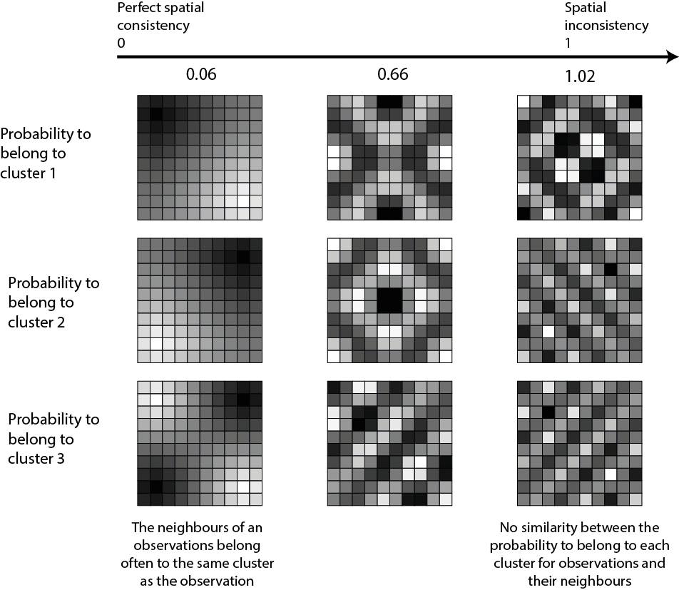

```{r setup, include=FALSE}
knitr::opts_chunk$set(echo = TRUE)
```


## Introduction

This vignette is a short description of an adjusted version of the spatial inconsistency index proposed in the package **geocmeans**. For a published reference, please consider citing @gelb2021apport.

Most of the time, data with a spatial component show an autocorrelated structure: close observations tend to be more similar than distant ones. Classical unsupervised classification algorithms do not account for space and tend to produce scattered results. In other words, some close observations may end up in different clusters despite their differences not being too pronounced. Spatially aware clustering algorithms try to correct this by spatially smoothing the results.

## Spatial inconsistency index

We proposed an index $S_{cr}$ to measure the spatial inconsistency of a classification considering its membership matrix $u$ and a spatial weight matrix $w$. It is simply the sum of the Euclidean distance of each observation $k$ to its spatial neighbours $l$ on the membership matrix, weighted by the spatial wight matrix.

$$S_{cr}=\sum_{k=1}^{k} \sum_{l=1}^{l} w_{k l}\left\|u_{k}-u_{l}\right\|^{2}$$

Because it is based on the euclidean distance, this index is related to the Gueary's C:

$$C=\frac{(N-1) \sum_{k} \sum_{l} w_{k l}\left(x_{k}-x_{l}\right)^{2}}{2 W \sum_{k}\left(x_{k}-\bar{x}\right)^{2}}$$

We also propose to standardize this sum by the total spatial inconsistency under the assumption of total spatial randomness (obtained by repeated permutation). A small value of this index indicates a strong spatial consistency as observations tend to belong to the same clusters as their neighbours. A value close to one indicates that the spatial inconsistency of the classification is close to what one can expect from a situation of total spatial randomness.

<center>
{width=400px}
</center>

It is easy to calculate this index with the package **geocmeans** using the function `spConsistency`

```{r message=FALSE, warning=FALSE, fig.pos="H", fig.align="center"}
library(spdep)
library(geocmeans)
library(ggplot2)

spdep::set.mcOption(FALSE)
spdep::set.coresOption(1L)

#preparing the data
data("LyonIris")

#selecting the columns for the analysis
AnalysisFields <-c("Lden","NO2","PM25","VegHautPrt","Pct0_14",
                   "Pct_65","Pct_Img","TxChom1564","Pct_brevet","NivVieMed")

#rescaling the columns
Data <- sf::st_drop_geometry(LyonIris[AnalysisFields])
for (Col in names(Data)){
  Data[[Col]] <- scale(Data[[Col]])
}

#creating the queen spatial weight matrix
Neighbours <- poly2nb(LyonIris,queen = TRUE)
WMat <- nb2listw(Neighbours,style="W",zero.policy = TRUE)

#applying SFCM algorithm
SFCM <- SFCMeans(Data, WMat, k = 4, m = 1.5, alpha = 0.7,
                 tol = 0.0001, standardize = FALSE,
                 verbose = FALSE, seed = 456)

#calculating the spatial inconsistency index (more replications are recommended)
consistIndex <- spConsistency(SFCM$Belongings, WMat, nrep = 100)

ggplot() +
  geom_histogram(aes(x = consistIndex$samples),
                 bins = 30, fill = "white", color = "black") +
  geom_vline(aes(xintercept = consistIndex$Mean),
             color = "red", linetype="dashed", size = 1) +
  geom_text(aes(x = consistIndex$Mean+0.0015, y = 43,
                label = round(consistIndex$Mean,2))) +
  labs(x = "Spatial Inconsistency Index", y = "")
```
So on average, for this classification, the spatial inconsistency index is about 0.18.

## Adjusted spatial inconsistency index

The spatial inconsistency index presented above has two drawbacks :

* first, as the number of clusters increases, the index will increase as well because more borders will be needed to delimit them in space.
* second, two close observations should not have to belong to the same group if they are very dissimilar.

To adjust the index, we propose to replace the spatial weight matrix used in the calculus by a semantico-spatial matrix. In this matrix, the spatial weight between two neighbours is replaced by the inverse of the Euclidean distance between their attributes.

$$W_{kl} = \frac{1}{||k-l||^2}$$

Thus, if two neighbours do not belong to the same cluster, but are very dissimilar, this new semantico-spatial weight matrix will limit the weight of their dissimilarity in the spatial inconsistency index. Note, the new spatial matrix must be standardized globally (and not by row) to consider the differences between observations for the full dataset and not only at the local level. This second index is noted $S_{mcr}$.

It is easy to calculate this adjusted version with the package **geocmeans** by using the function *adjustSpatialWeights*.

```{r message=FALSE, warning=FALSE, fig.pos="H", fig.align="center"}
WMat2 <- adjustSpatialWeights(Data, WMat$neighbours, style = "C")
# (more replications are recommanded)
consistIndex2 <- spConsistency(SFCM$Belongings, WMat2, nrep = 100)

ggplot() +
  geom_histogram(aes(x = consistIndex2$samples),
                 bins = 30, fill = "white", color = "black") +
  geom_vline(aes(xintercept = consistIndex2$Mean),
             color = "red", linetype="dashed", size = 1) +
  geom_text(aes(x = consistIndex2$Mean+0.0015, y = 43,
                label = round(consistIndex2$Mean,2))) +
  labs(x = "Adjusted Spatial Inconsistency Index", y = "")
```

When working with rasters, it is not efficient to update the window used to define neighbouring for each pixel and to store them. Instead, the function `spConsistency` can be used directly on an `FCMres` object with the parameter `adj` set to `TRUE` to obtain the adjusted spatial inconsistency index.

## References
